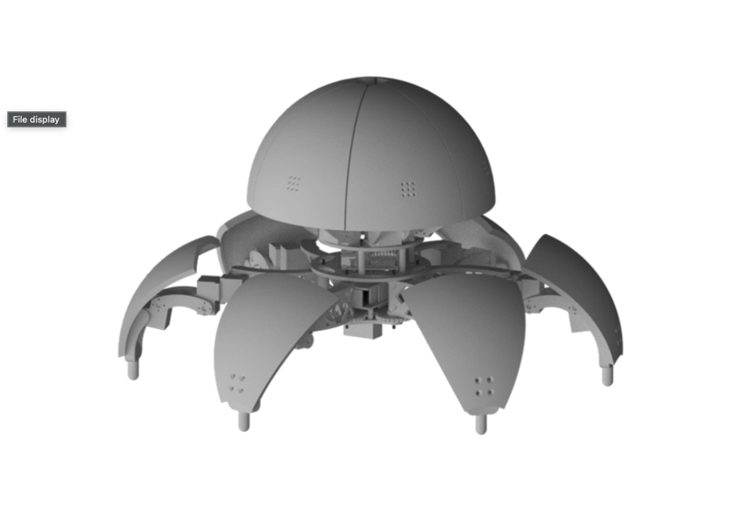

# Shell Robot Simulator - Hexamorph

The simulated robot, named "shell" due to its distinctive shell-like shape, is a parallel robot specifically characterized as a hexapod. It not only has the capability to walk like a hexapod but also features an additional mode of movement—it can roll and advance like a ball.

 


## Features

- **Hexapod Configuration:** The robot is equipped with six legs or limbs, providing enhanced stability and flexibility in movement.
- **Versatile Movement:** In addition to walking, the robot can switch to a rolling mode, allowing it to move like a ball. This adds adaptability to different terrains and scenarios.

## Technical Details

- **Actuators and Sensors:** Dynamixel motors AX16
- **Power and Control:** Jetson Nano and Li-Ion batteries

## Purpose

The "shell" robot serves various purposes owing to its unique features:

- **Exploration in Challenging Environments:** The hexapod configuration allows the robot to navigate through rough terrains, making it suitable for exploration in challenging environments such as disaster-stricken areas, construction sites, or remote landscapes.
- **Search and Rescue Operations:** The robot can be deployed for search and rescue missions where its ability to adapt to different modes of movement is beneficial in accessing hard-to-reach areas.
- **Surveillance and Monitoring:** With its walking and rolling capabilities, the robot can be used for surveillance and monitoring applications. It can patrol areas, providing real-time data and video feed for security purposes.
- **Adaptive Transportation:** The rolling mode enables efficient and fast transportation in open spaces. The robot can be employed for moving small payloads or equipment across large areas.
- **Educational Tool:** The robot can serve as an educational tool for robotics and programming. Students and researchers can use it to understand the principles of parallel robots and experiment with different control algorithms.
- **Entertainment and Interaction:** The unique rolling feature makes the robot suitable for entertainment purposes. It could be used in interactive exhibits or as a programmable robotic toy.
- **Environmental Data Collection:** Equipped with sensors, the robot can collect environmental data, such as temperature, humidity, or pollution levels, in various locations.
- **Assistance for People with Disabilities:** The robot's adaptability could be utilized to assist people with disabilities by providing support in tasks like fetching objects or navigating through specific environments.
- **Research and Development:** The robot can be a platform for research in robotics and parallel mechanisms. Researchers can use it to test new control algorithms, sensors, or materials.

## Simulation

The simulation of the robot is an integral part of its development. Virtual testing allows for the optimization of the robot's behavior under various conditions before real-world implementation.

## Launching Simulation using `shell_robot_gazebo.launch`

1. **Open a Terminal:**
   Open a terminal on your system where you have ROS installed.

2. **Navigate to the Package:**
   Change your directory to the package containing the launch file. Assuming your package is named `shell_robot`, you can use the following command:
   ```bash
   cd path/to/your/catkin_workspace/src/shell_robot
3.  **source ROS
    ```bash
    source /opt/ros/<your_ros_version>/setup.bash 
4. build the Package:
    ```bash
    catkin_make
5. source again
   ```bash
   source devel/setup.bash
7. launch
   ```bash
   Roslaunch shell_robot_gazebo shell_robot_gazebo.launch

### Note:
This assumes that your launch file is correctly set up and configured. If there are any errors or missing dependencies, you may need to resolve them before the simulation can run successfully. Also, make sure that Gazebo is properly installed and configured on your system.

Please adapt the commands and paths based on your specific project structure and ROS version. If you encounter any issues or have additional details about your environment, feel free to provide more information for further assistance.

Here my report on the robot: [shell](https://github.com/lucaricciatl/shellbot-urdf/blob/main/relazione%20shell%20robot%20.pdf)
